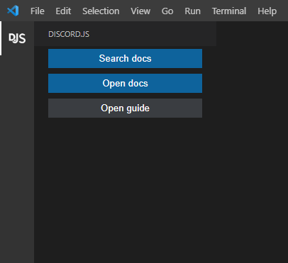
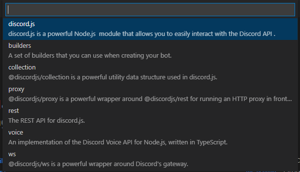
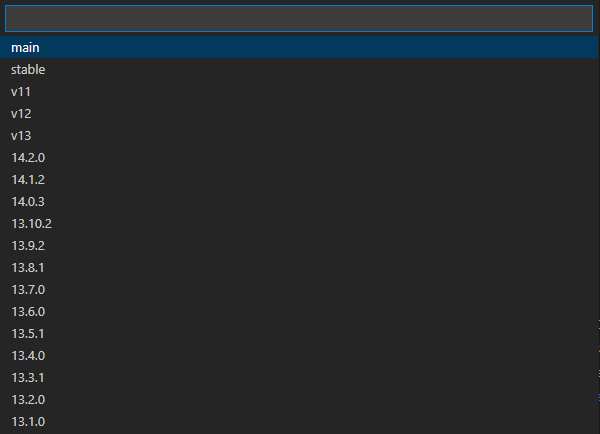
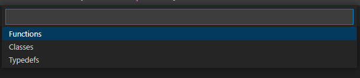
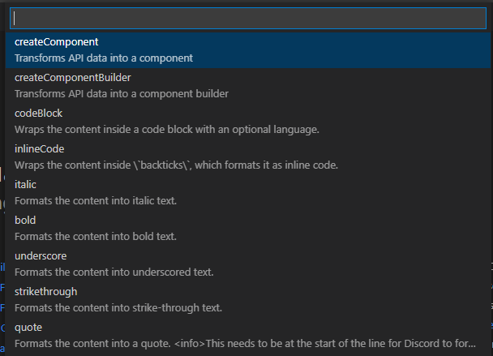
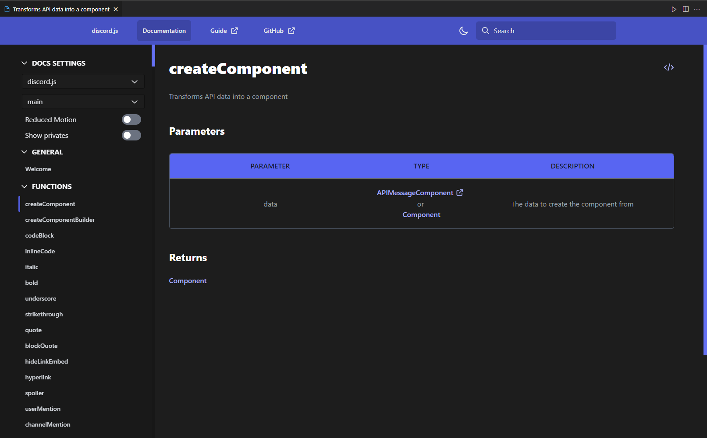

# Discord.js docs 📖

Some tools that can help you reach discord.js docs and guide fast

***

## Commands:

<ul>
<li>1. searchDocs</li>
<li>2. openDocs</li>
<li>3. openGuide</li>
</ul>

***

## How to search 🔎:

<ul style="list-style-type: none; ">
<li>
<h4>Run the command:</h4>

</li>

***

<li>
<h4>Choose a package:</h4>

</li>

***

<li>
<h4>Choose package version:</h4>

</li>

***

<li>
<h4>Choose section:</h4>

</li>

***

<li>
<h4>Choose the thing you want to know about:</h4>

</li>

***

<li>
<h4>Congrats 🎉:</h4>

</li>

</ul>

***

## Another way to search:
